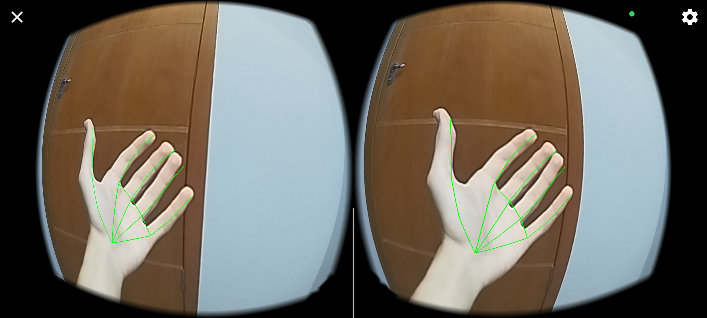

# Cardboard++
## Bringing Google Cardboard Closer to a Meta Quest!

I'm making this software with one goal: bringing features normally exclusive to expensive VR (like the Meta Quest) to a simple Google Cardboard.
These features include:

### Hand tracking

  

### 6DOF (degrees of freedom)

### SteamVR compatibility

### And even using Xbox controllers as virtual VR controllers!

---

The project is still a work in progress. But trust me, when you see the code, you will know there's a lot of work to do.
I'm working to implement the features I want and to make the project work. If you're a developer too, **all contributions are welcome.**

## Current progress
- [x] Camera preview
- [x] Hand tracking (currently slow, but will be moved to the computer when the driver is ready)
- [x] 6DoF (unstable)
- [ ] SteamVR driver
- [ ] Controller emulation
